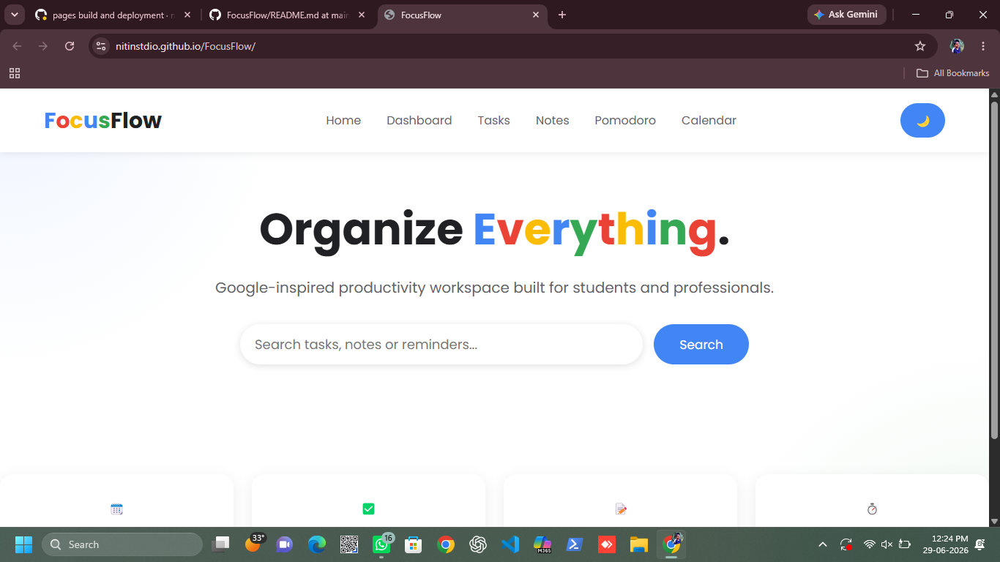
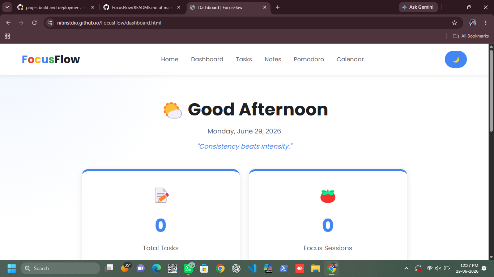
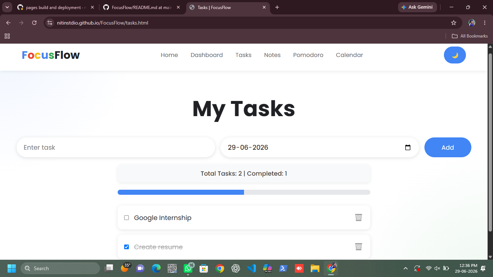
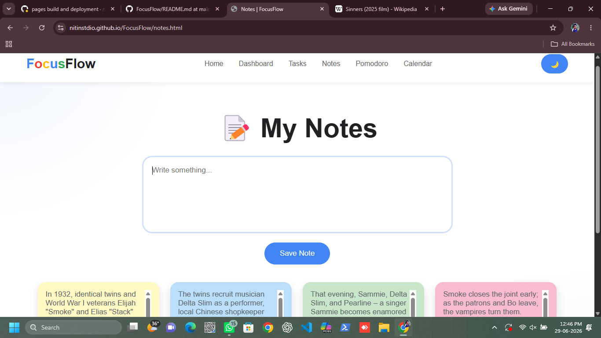
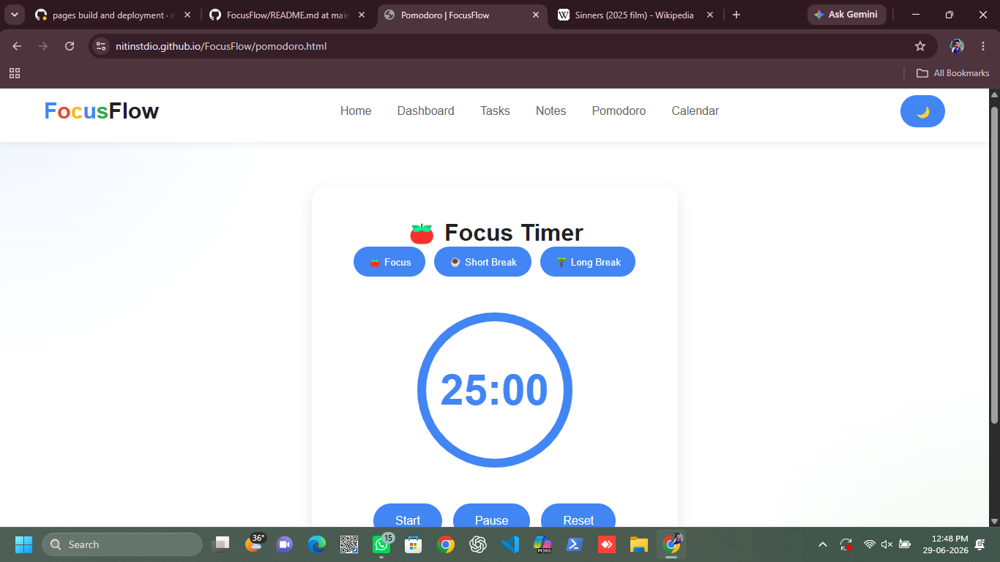
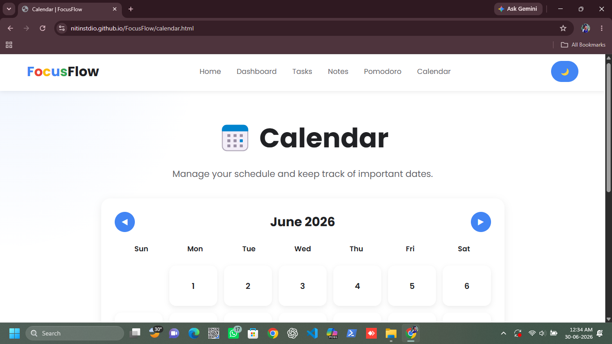
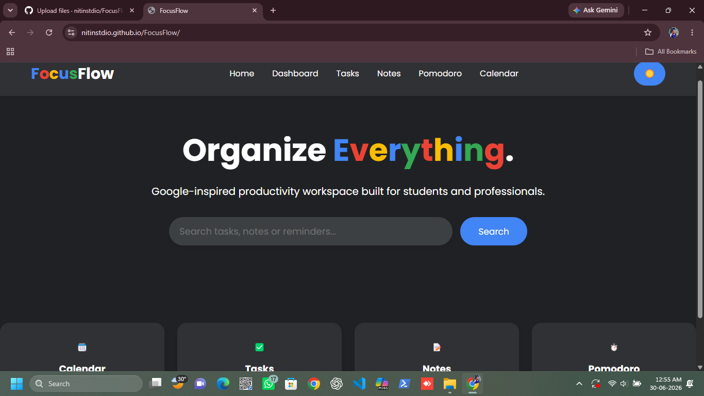

# FocusFlow

A Google-inspired productivity web application built using HTML, CSS, and JavaScript to help users organize tasks, manage notes, track focus sessions, and improve productivity.

## 🌐 Live Demo

https://nitinstdio.github.io/FocusFlow/

## ✨ Features

- ✅ Task Management
- 📝 Notes
- ⏱️ Pomodoro Timer
- 📅 Calendar
- 📊 Productivity Dashboard
- 🌙 Dark & Light Mode
- 📱 Responsive Design

## 🛠️ Tech Stack

- HTML5
- CSS3
- JavaScript

## 📂 Project Structure

```
index.html
style.css
script.js
dashboard.html
dashboard.js
tasks.html
notes.html
pomodoro.html
calendar.js
theme.js
```

## 🚀 Future Improvements

- User Authentication
- Cloud Synchronization
- Data Backup
- Notifications
- Mobile Application

## 📸 Screenshots

### 🏠 Home


### 📊 Dashboard


### ✅ Tasks


### 📝 Notes


### ⏱️ Pomodoro Timer


### 📅 Calendar


### 🌙 Dark Mode


## 👨‍💻 Author

*Nitin Krishna K E*

GitHub: https://github.com/nitinstdio
Repository: https://github.com/nitinstdio/FocusFlow                                 

